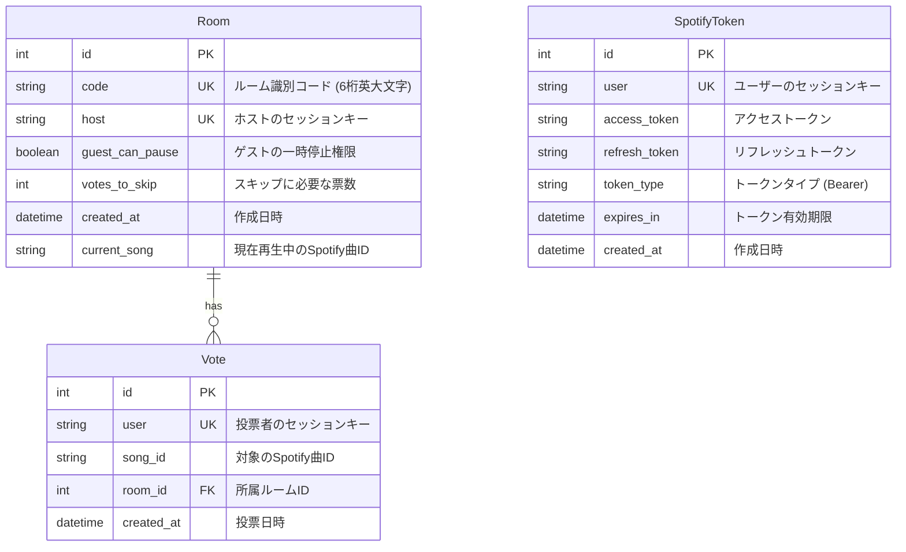

# Music Controller

サービスURL: <!-- TODO: デプロイURL。未デプロイなら削除 -->

 <!-- TODO: OGP/トップ画像 -->

### 離れた場所にいる音楽友達と、リアルタイムで同じ音楽を聴きながら繋がる共同プレイリストコントローラー

本プロジェクトは、Spotify API と連携し、同一の「バーチャルルーム」に参加している複数ユーザー間で音楽再生をリアルタイムに同期・操作できるWebアプリケーションです。ホストの Spotify アカウントを通じて、ルームに参加したゲスト全員が一緒に音楽を聴き、スキップ投票や再生コントロールを行うことができます。

**【デモ / ゲストアカウント】** <!-- TODO: デモ動画やテストアカウントがあれば記載。なければ削除 -->

---

## 開発背景

このアプリは、**「ライブや音楽フェスで出会った、共通の音楽の趣味を持つ友人たちと、離れた場所にいても一緒に音楽を聴いて盛り上がり、語り合いたい」**という原体験から開発しました。

従来の音楽配信サービスでは、個々人が別々に音楽を再生するしかなく、同じ瞬間に同じ曲の同じフレーズを聴いて感情を共有することが困難でした。この課題を解決するため、1つの Spotify 再生セッションを仮想的なルームを通じて共有し、ゲスト全員が再生・一時停止の提案やスキップ投票を行える共同音楽リスニング空間を構築しました。

---

## 主要な機能

| 機能名 | 説明 |
| --- | --- |
| **ルーム作成 & 設定管理** |  ホストとして新規の音楽ルームを作成できます。作成時に「ゲストによる一時停止の許可/禁止」や「曲のスキップに必要な投票数」をカスタマイズでき、ルーム作成後もいつでも設定を変更可能です。 |
| **ルーム参加** |  6桁のユニークなルームコードを入力するだけで、ユーザー登録なしで即座に他のユーザーのルームにゲストとして参加できます。 |
| **Spotify OAuth 連携** |  ホストの Spotify アカウントと連携し、認証情報をセキュアに保持します。ゲストは Spotify アカウントを持っていなくても、ホストの再生中の音楽を一緒に聴くことができます。 |
| **リアルタイム再生同期** |  ルーム内の全員の画面に、現在再生中の曲のタイトル、アーティスト、アルバムアート、曲の進行状況（プログレスバー）、再生/一時停止状態がリアルタイムに同期表示されます。 |
| **共同再生コントロール** |  ホスト、およびホストから権限を与えられたゲストは、ブラウザ上のボタンから直接 Spotify の再生・一時停止を操作できます。 |
| **スキップ投票システム** |  ゲストが「次の曲を聴きたい」場合にスキップ投票を行えます。投票数が設定値に達すると自動的に次の曲へ進みます（ホストは投票不要で即時スキップ可能）。曲が切り替わると投票数は自動でリセットされます。 |

---

## 使用技術

| カテゴリ | 技術（バージョン） |
| --- | --- |
| **フロントエンド** | React (`^19.2.4`), React Router DOM (`^6.30.3`), Material-UI (`^7.3.9`), Emotion (`^11.14.0`) |
| **バックエンド** | Python, Django (`>=5.0,<6.0`), Django REST Framework (`>=3.15,<4.0`) |
| **データベース** | SQLite 3 (ローカル開発用) |
| **ビルドツール** | Webpack (`^5.105.4`), Babel (`^7.29.0`) |
| **API 連携** | Spotify Web API (OAuth 2.0 認証) |
| **その他** | `requests` (APIクライアント), `python-dotenv` (環境変数管理) |

---

## 技術選定理由

*   **Django & Django REST Framework (DRF) × React 19**
    Python の堅牢なバックエンド設計・データ処理能力を学習しつつ、フロントエンドにはコンポーネント志向でインタラクティブな UI を構築できる React を採用し、両者の統合開発手法を習得することを目的に選定しました。
*   **Django セッションを用いた匿名ユーザー管理**
    ユーザーに面倒な会員登録やログインを要求せず、URL共有だけで即座に共同リスニング体験を提供するため、Django の標準セッション機能 (`session_key`) を用いてゲストを識別し、ルームへの紐付けやスキップ投票の二重投票防止を実現しました。
*   **1秒間隔のポーリングによる同期（要確認）**
    本アプリケーションでは、簡易的かつ確実に Spotify の再生状態（曲の進捗秒数など）を同期するため、React の `setInterval` を利用した1秒間隔の API ポーリングを採用しています。
    *※（要確認）将来的なスケールやサーバー負荷の軽減、より低遅延なリアルタイム同期を実現するためには、WebSocket (Django Channels) への移行が技術的課題として挙げられます。*

---

## インフラ構成図（ローカル開発環境）

ローカル環境における各コンポーネントの通信および連携フローは以下の通りです。

```mermaid
graph TD
    subgraph Client [クライアントサイド (フロントエンド)]
        React[React SPA / Material-UI]
    end

    subgraph Server [サーバーサイド (バックエンド)]
        Django[Django / Django REST Framework]
        SQLite[(SQLite DB)]
    end

    subgraph External [外部サービス]
        Spotify[Spotify Web API]
    end

    %% 通信フロー
    React <-->|1. HTTP / REST API| Django
    React -.->|2. 1秒間隔ポーリング| Django
    Django <-->|3. データ保存 / 参照| SQLite
    Django <-->|4. OAuth & 再生制御 / 状態取得| Spotify
```

---

## ER図

本システムは、セッションベースのルーム管理と Spotify 認証トークン、および投票情報を以下のスキーマで管理しています。



### 設計の意図
1.  **`Room.host` と `SpotifyToken.user` の紐付け**:
    ホストのセッションキーをキーとして Spotify の OAuth トークンを管理します。これにより、誰がホストであるかを判定し、そのホストのアクセストークンを用いて Spotify API に再生状態の問い合わせや操作リクエストを行います。
2.  **`Vote.user` のユニーク制約**:
    `Vote` テーブルの `user` フィールドに `unique=True` を設定することで、1人のユーザー（セッション単位）が同時に複数の投票を行えないようにデータベースレベルで整合性を保っています。曲が切り替わった際には、該当ルームの投票データを全削除するトリガーが実行されます。

---

## ローカル環境構築手順

本プロジェクトをローカル環境で起動するための手順です。

### 前提条件
- Python 3.8 以上
- Node.js (v16以上推奨) および npm

### 1. リポジトリのクローン
```bash
git clone <repository_url>
cd music_controller
```

### 2. バックエンドの設定 (Django)
仮想環境を作成し、依存パッケージをインストールします。

```bash
# 仮想環境の作成と有効化
python -m venv venv
source venv/bin/activate  # Windowsの場合: venv\Scripts\activate

# 依存パッケージのインストール
pip install -r requirements.txt
```

#### 環境変数の設定
プロジェクトのルートディレクトリに `.env` ファイルを作成し、ご自身の [Spotify Developer Dashboard](https://developer.spotify.com/dashboard/applications) で取得した認証情報を設定します。

```dotenv
SPOTIFY_CLIENT_ID=your_spotify_client_id
SPOTIFY_CLIENT_SECRET=your_spotify_client_secret
SPOTIFY_REDIRECT_URI=http://127.0.0.1:8000/spotify/redirect
```
*※ Spotify デベロッパーダッシュボード側でも、上記と全く同じ Redirect URI を `Redirect URIs` 設定に登録してください。*

#### データベースマイグレーション
```bash
python manage.py makemigrations
python manage.py migrate
```

### 3. フロントエンドの設定 (React)
`frontend` ディレクトリに移動し、npm パッケージをインストールして Webpack によるビルドを実行します。

```bash
cd frontend
npm install

# 開発用ビルド（ファイルの変更を自動監視・コンパイル）
npm run dev
```

### 4. サーバーの起動
別のターミナルを開き、仮想環境を有効化した状態でルートディレクトリから Django 開発用サーバーを起動します。

```bash
python manage.py runserver
```

サーバー起動後、ブラウザで `http://127.0.0.1:8000` にアクセスするとアプリケーションを利用できます。

---

## こだわった実装

### 1. セッションベースの匿名投票システムと二重投票防止
ユーザーにアカウント作成の手間をかけさせず、セッション単位でスキップ投票を管理するロジックをバックエンドで実装しています。

*   **該当コード**: [`spotify/views.py`](file:///Users/macuser/dev/React-Django-Tutorial/music_controller/spotify/views.py#L128-L142)
```python
class SkipSong(APIView):
  def post(self, request, format=None):
    room_code = self.request.session.get('room_code')
    room = Room.objects.filter(code=room_code)[0]
    votes = Vote.objects.filter(room=room, song_id=room.current_song)
    votes_needed = room.votes_to_skip

    # ホスト自身が操作するか、必要な投票数に達した場合は即スキップ
    if self.request.session.session_key == room.host or len(votes) + 1 >= votes_needed:
      votes.delete()
      skip_song(room.host)
    else:
      # 投票レコードを作成（DB側で user フィールドに unique=True があるため多重投票を防止）
      vote = Vote(user=self.request.session.session_key, room=room, song_id=room.current_song)
      vote.save()
    
    return Response({}, status.HTTP_204_NO_CONTENT)
```
*   **解説**: Django の `session_key` を用いて、ログインしていないゲストの一意性を保証しています。また、曲がスキップされた、または別の曲に自然に切り替わった際には、DB上の古い曲に対する投票レコード (`Vote`) を自動的に一括クリーンアップする仕組みにすることで、データが残存しない設計にしています。

### 2. Spotify OAuth トークンの自動ライフサイクル管理
Spotify のアクセストークンは1時間で失効するため、APIリクエストを送信する直前に有効期限を自動チェックし、必要に応じてバックグラウンドでリフレッシュトークンを用いて再取得する仕組みを共通化しています。

*   **該当コード**: [`spotify/util.py`](file:///Users/macuser/dev/React-Django-Tutorial/music_controller/spotify/util.py#L39-L64)
```python
def is_spotify_authenticated(session_id):
  tokens = get_user_tokens(session_id)
  if tokens:
    expiry = tokens.expires_in
    # 有効期限が切れている、または差し迫っている場合はトークンを自動更新
    if expiry <= timezone.now():
      refresh_spotify_token(session_id)
    return True
  
  return False

def refresh_spotify_token(session_id):
  refresh_token = get_user_tokens(session_id).refresh_token

  response = post('https://accounts.spotify.com/api/token', data={
    'grant_type': 'refresh_token',
    'refresh_token': refresh_token,
    'client_id': CLIENT_ID,
    'client_secret': CLIENT_SECRET,
  }).json()

  access_token = response.get('access_token')
  token_type = response.get('token_type')
  expires_in = response.get('expires_in')

  update_or_create_user_tokens(session_id, access_token, token_type, expires_in, refresh_token)
```
*   **解説**: API利用時にトークンの期限切れエラーによるハンドリングを個別に行うのではなく、ラッパー関数 `execute_spotify_api_request` の前段や、フロントエンドからの「認証済みか？」の問い合わせの中で透過的にリフレッシュを行うことで、ユーザー体験を一切損なわないシームレスな操作感を実現しました。

### 3. React Router v6 Hooks とクラスコンポーネントの協調
本プロジェクトの主要画面は状態管理やライフサイクルメソッド (`componentDidMount` 等) の都合上クラスコンポーネントで設計されていますが、React Router v6 ではルーティング機能が Hooks (`useParams`, `useNavigate`) でしか提供されていません。これらを仲介するラッパーを作成して統合しました。

*   **該当コード**: [`frontend/src/components/Room.js`](file:///Users/macuser/dev/React-Django-Tutorial/music_controller/frontend/src/components/Room.js#L8-L14)
```javascript
// ラッパー関数（Hooks → クラスコンポーネント橋渡し）
function withRouter(WrappedComponent) {
  return function (props) {
    const params = useParams();
    const navigate = useNavigate();
    return <WrappedComponent {...props} params={params} navigate={navigate} />;
  };
}
```
*   **解説**: 高階コンポーネント (HOC) パターンを自作し、`useParams` で取得した URL パラメータ（`roomCode`）や、プログラム的な画面遷移を行うための `navigate` 関数を props としてクラスコンポーネントに安全に注入しています。これにより、React の新しいエコシステムを活用しながら、クラスコンポーネントの資産を綺麗に活かす設計となっています。

---

## 今後の開発について
- **WebSocket (Django Channels) への移行**: 現在は1秒ごとのポーリングで再生状態を同期していますが、同時接続ユーザー数が増えた際のサーバー負荷低減と、より滑らかな再生位置のリアルタイム同期を目指し、双方向リアルタイム通信へアップデート予定。
- **チャット機能の追加**: 音楽を一緒に聴きながらその場でリアルタイムに意見を交わせるテキストチャットエリアの追加。
- **プレイリスト追加・検索機能**: ホストのプレイリストだけでなく、ルーム内のゲストが Spotify 上の曲を検索し、次に再生する曲の候補として「キュー（待ち行列）」へ追加できる機能の構築。
